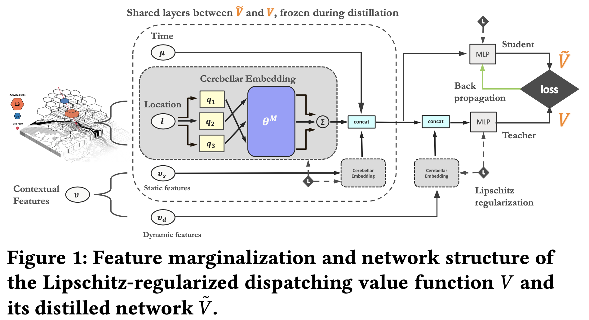
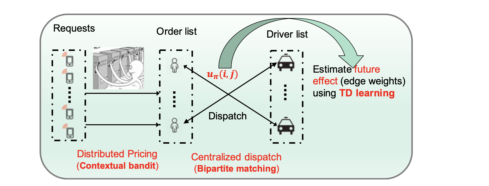
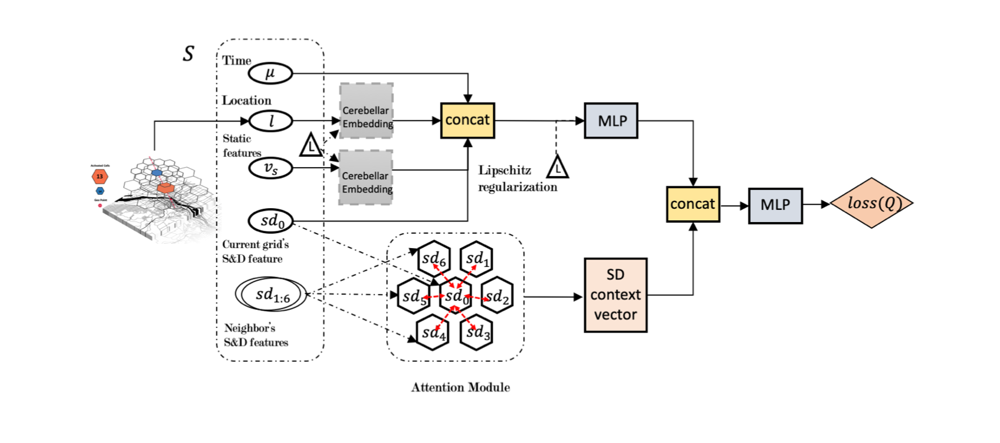

# RL-for-Transportation
Paper list of Reinforcement Learning (RL) applied on transportation

- [RL-for-Transportation](#rl-for-transportation)
  - [Ride-souring system](#ride-souring-system)
    - [Survey](#survey)
    - [Dataset](#dataset)
    - [Competition](#competition)
    - [Book](#book)
    - [Paper](#paper)
      - [Order dispatching](#order-dispatching)
      - [Order delaying](#order-delaying)
      - [Order pooling](#order-pooling)
      - [Order pricing](#order-pricing)
      - [Vehicle relocation](#vehicle-relocation)
      - [Joint dispatching and relocation](#joint-dispatching-and-relocation)
  - [Intersection control](#intersection-control)
    - [Survey](#survey-1)
    - [Dataset](#dataset-1)
    - [Competition](#competition-1)
    - [Paper](#paper-1)
      - [Single-agent](#single-agent)
      - [Multi-agent](#multi-agent)

## Ride-souring system
### Survey
1. [Reinforcement Learning for Ridesharing: A Survey. 2021](https://arxiv.org/pdf/2105.01099)
### Dataset
1. [DiDi GAIA Dataset](https://outreach.didichuxing.com/research/opendata/)
### Competition
1. [Learning to Dispatch and Reposition on a Mobility-on-Demand Platform](https://www.biendata.xyz/competition/kdd_didi/)
### Book
1. Approximate Dynamic Programming: Solving the curses of dimensionality. Powell, W. B. (2007).
   
### Paper
#### Order dispatching
1. [A Taxi Order Dispatch Model based On Combinatorial Optimization. 2017. KDD](https://dl.acm.org/doi/pdf/10.1145/3097983.3098138)
    1. predict cancellation probability of vehicle-order pair $p_{ij}$
    2. maximize total success rate: 
        
        1. $a_{ij}$: matching decision
        2. NP hard combinatorial optimization
           1. HillClimbing Algorithm
2. [Large-scale order dispatch in on-demand ride-hailing platforms: A learning and planning approach. (2018). KDD](https://dl.acm.org/doi/pdf/10.1145/3219819.3219824)
   1. bipartite matching + evaluation

       1. weight: advantage trick
          1. discounted reward + furture value - current value 
          
       2. state: time & space zone (no contextual information)
       3. value: policy evaluation (offline)
          

1. [A Deep Value-network Based Approach for Multi-Driver Order Dispatching. 2019. KDD](https://dl.acm.org/doi/pdf/10.1145/3292500.3330724)
   1. bipartite matching + policy evaluation
   
      1. weight: advantage value - distance
        
      2. state: 
         1. time & space zone + supply-demand info
         2. coarse coding with hierarchical hexagon grid
      3. value (offline)
         1. policy evaluation: with supply-demand info
         2. distillation: marginalize time-space value

2. [Efficient Ridesharing Order Dispatching with Mean Field Multi-Agent Reinforcement Learning. 2019. WWW](https://dl.acm.org/doi/pdf/10.1145/3308558.3313433)
    1. MARL (on policy)
         1. state: contextual information
         2. acrion: active order pool
            1. mean action: defined as number of neighbor drivers
         3. reward:
            1. order fare
            2. pick distance
            3. destination supply-demand gap
3. [Multi-Agent Reinforcement Learning for Order-dispatching via Order-Vehicle Distribution Matching. 2019. CIKM](https://dl.acm.org/doi/pdf/10.1145/3357384.3357799)
    1. MARL (on policy)
       1. state: contextual features
       2. TD loss + KL regulizer
   
          1. regulizer: distribution between order and vehicles

#### Order delaying
1. [Learning to delay in ride-sourcing systems: a multi-agent deep reinforcement learning framework. 2019. TKDE](https://ieeexplore.ieee.org/stamp/stamp.jsp?tp=&arnumber=9130935)
    1. MARL (on policy)
       1. state: contextual features
       2. action: {0,1}, match or hold
       3. reward: customer waiting time
          1. weighted global + individual reward

2. [Optimizing matching time intervals for ride-hailing services using reinforcement learning. 2021. TRC](https://www.sciencedirect.com/science/article/abs/pii/S0968090X21002527)
   1. RL (off policy)
      1. state: global grid-based state -> flatten
      2. action: {0,1}, match or hold
      3. reward:
         1. matching wating time
         2. pickup wiating time

#### Order pooling
1. [Optimizing Taxi Carpool Policies via Reinforcement Learning and Spatio-Temporal Mining. 2018. Big Data](https://ieeexplore.ieee.org/document/8622481)
   1. RL (on policy)
      1. state: time & space grid
      2. action: wait, TK1, TK2
         1. wait: stay current location
         2. TK1: pick orders within max pick time
         3. TK2: TK1 + larger pick time for second order
      3. reward: effective distance traveled

2. [DeepPool: Distributed Model-free Algorithm for Ride-sharing using Deep Reinforcement Learning. 2019. ITS](https://ieeexplore.ieee.org/abstract/document/8793143)
    1. RL (on policy)
       1. state: global supply-demand profile map
       2. action (sequentially): follow shorest path
          1. find another customer 
          2. next zone 
       3. reward
          1. served customer
          2. detour time

3. [AdaPool: A Diurnal-Adaptive Fleet Management Framework using Model-Free Deep Reinforcement Learning and Change Point Detection. 2021.](https://arxiv.org/pdf/2104.00203.pdf)
    1. The same as DeepPool
       1. consider the change of MDP （with different models）
       2. online Dirichlet change point detection (ODCP) to detect changes

4. [An Integrated Decomposition and Approximate Dynamic Programming Approach for On-Demand Ride Pooling. 2018. ITS](https://ieeexplore.ieee.org/document/8805157)
    1. ADP 
       1. decision 
          1. routes is determined using the shortest-path strategy
          2. one decision one assignment
          3. linear approximation for value function
          4. linear assignment problem
             1. dual update

5. [Neural Approximate Dynamic Programming for On-Demand Ride-Pooling. 2020. AAAI](https://ojs.aaai.org//index.php/AAAI/article/view/5388)
   1. ADP
      1. decision
         1. follow shorest path
         2. generate feasible order combinations
         3. value approximation: individual value 
            
            1. low-dimensional embedding for each location of vehicle
         4. linear assignment 
            1. TD update
6. [Conditional Expectation Based Value Decomposition For Scalable On-demand Ride Pooling]()
   1. like NeuralADP
      1.  average of neighbor value to approximate indivadule value:
      2.  each neighbor value is the conditional expectation of action
         
      3. final approximation
         
 

#### Order pricing
1. [InBEDE: Integrating Contextual Bandit with TD Learning for Joint Pricing and Dispatch of Ride-Hailing Platforms. 2019. ICDM](https://ieeexplore.ieee.org/document/8970929)
    1. RL (on-policy)
       1. use TD learning to calculate furture value
       2. use Contextual Bandit to give price

#### Vehicle relocation
1. [A Cost-Effective Recommender System for Taxi Drivers. 2014. KDD](https://dl.acm.org/doi/pdf/10.1145/2623330.2623668)
    1. recommend route for vacant vehicles
       1. segment profit
          1. earning:
   
          2. cost: 
   
       2. expected route profits:

       3. algorithm 
          1. Brute-Force based MNP Recommendation
          2. Recursive Recommendation Strategy
       4. multi-driver routes recommendation
          1. recommend the route with the lowest correlationship to the second driver

2. [Optimizing Taxi Driver Profit Efficiency: A Spatial Network-based Markov Decision Process Approach. 2015. Big Data]()
   1. Defined as MDP:
      1. calibrate pick probability (discounted by number of taxis)
      2. passenger destination probability
   2. solving
      1. Rolling Horizon:
      2. DP approach
         1. discounting pick prob:
         

3. [Optimal Passenger-Seeking Policies on E-hailing Platforms Using Markov Decision Process and Imitation Learning. 2020. TRC](https://arxiv.org/pdf/1905.09906.pdf)
   1. similar to last one
      1. long-horizon 
      2. discounted prob of competing drivers
    

4. [MOVI: A Model-Free Approach to Dynamic Fleet Management. 2018. INFOCOM](https://ieeexplore.ieee.org/stamp/stamp.jsp?arnumber=8485988)
    1. RL (on-policy)
       1. state: heatmap + CNN
       2. making decision sequentially for each vehicle

5. [Credit Assignment For Collective Multiagent RL With Global Rewards. 2018. NIPS](https://proceedings.neurips.cc/paper/2018/file/94bb077f18daa6620efa5cf6e6f178d2-Paper.pdf)
    1. MARL (on policy)
       1. centralize critic + decentralized policy
       2. conut based global state
     
       3. difference policy gradient
            1. Wonderful Life Utility (WLU)
               1. with and without agent i
   
            1. Aristrocratic Utility (AU)
               1. fix actions of other agents, marginalize agent i
               2. conterfactual
   
        4. approximating central xritic
           1. linear combination
              1. individual information
              2. f without info of other agents
   
           2. first-order approximation
              1. those coefficients are evaluated at the overall state-action counts
   

6. [Efficient Large-Scale Fleet Management via Multi-Agent Deep Reinforcement Learning. 2018. KDD](https://dl.acm.org/doi/pdf/10.1145/3219819.3219993)
    1. RL (on-policy)
       1. state + contextual features
       2. action: neighbor girds
          1. sequentially make decision
          2. avoid moving in conflict directions
             1. add collaborative context indicating directions of previous vehicles
          3. avoid moving to low-value grid

7. [Real-world Ride-hailing Vehicle Repositioning using Deep Reinforcement Learning. 2020. NIPS](https://arxiv.org/pdf/2103.04555.pdf)
    1. Policy evaluation (off-line)
       1. time-space value function
   
          1. dual policy evaluation
             1. conditional value: V(s|b)
             2. marginal value: V(s)
          2. Value-based Policy Search (VPS)
             1. one-step:
   
             1. two-step:
   
          1. implementation
             1. step selection: small works well
             2. long search: choose global top points
             3. contextual value:
    
             1. SD regulizer
                1. add destination supply-demand gap
   

#### Joint dispatching and relocation
1. [CoRide: Joint Order Dispatching and Fleet Management for Multi-Scale Ride-Hailing Platforms. 2019. CIKM](https://dl.acm.org/doi/pdf/10.1145/3357384.3357978)
    1. 

2. [Deep Reinforcement Learning for Multi-Driver Vehicle Dispatching and Repositioning Problem. 2019. ICDM](https://ieeexplore.ieee.org/stamp/stamp.jsp?arnumber=8970873)

3. [Value Function is All You Need: A Unified Learning Framework for Ride Hailing Platforms. 2021. KDD](https://dl.acm.org/doi/pdf/10.1145/3447548.3467096)

4. [An Integrated Reinforcement Learning and Centralized Programming Approach for Online Taxi Dispatching. 2021. TNNLS](https://ieeexplore.ieee.org/stamp/stamp.jsp?arnumber=9366995)

5. [Path-based dynamic pricing for vehicle allocation in ridesharing systems with fully compliant drivers. 2019. TRB](https://www.sciencedirect.com/science/article/pii/S019126151831141X)

## Intersection control
### Survey 
1. [A survey on traffic signal control methods. 2019](https://arxiv.org/pdf/1904.08117.pdf)
2. [Recent advances in reinforcement learning for traffic signal control: A survey of models and evaluation. 2021](https://dl.acm.org/doi/pdf/10.1145/3447556.3447565)
### Dataset 
1. [Cityflow: A multi-agent reinforcement learning environment for large scale city traffic scenario](https://dl.acm.org/doi/pdf/10.1145/3308558.3314139) 
2. [Reinforcement Learning for Traffic Signal Control
](https://traffic-signal-control.github.io/#open-datasets)
### Competition
1. [City Brain Challenge](http://www.yunqiacademy.org/poster)

### Paper

#### Single-agent
1. [IntelliLight: A Reinforcement Learning Approach for Intelligent Traffic Light Control. 2018. KDD](https://dl.acm.org/doi/pdf/10.1145/3219819.3220096)
2. [Learning Traffic Signal Control from Demonstrations. 2019. CIKM](https://dl.acm.org/doi/pdf/10.1145/3357384.3358079)
3. [PressLight: Learning Max Pressure Control to Coordinate Traffic Signals in Arterial Network. 2019. KDD](https://dl.acm.org/doi/pdf/10.1145/3292500.3330949)
4. [PDLight: A Deep Reinforcement Learning Traffic Light Control Algorithm with Pressure and Dynamic Light Duration. 2020](https://arxiv.org/pdf/2009.13711.pdf)
5. [Toward A Thousand Lights: Decentralized Deep Reinforcement Learning for Large-Scale Traffic Signal Control. 2020. AAAI](https://ojs.aaai.org/index.php/AAAI/article/download/5744/5600)
6. [Learning Phase Competition for Traffic Signal Control. 2019. CIKM](https://dl.acm.org/doi/pdf/10.1145/3357384.3357900)
7. [AttendLight: Universal Attention-Based Reinforcement Learning Model for Traffic Signal Control. 2020. NIPS](https://arxiv.org/pdf/2010.05772.pdf)
8. [GeneraLight: Improving Environment Generalization of Traffic Signal Control via Meta Reinforcement Learning. 2020. CIKM](https://dl.acm.org/doi/pdf/10.1145/3340531.3411859)
9. [MetaLight: Value-Based Meta-Reinforcement Learning for Traffic Signal Control. 2020. AAAI](https://ojs.aaai.org/index.php/AAAI/article/view/5467/5323)
   
#### Multi-agent
1. [CoLight: Learning Network-level Cooperation for Traffic Signal Control. 2019. CIKM](https://dl.acm.org/doi/pdf/10.1145/3357384.3357902)
2. [Multi-agent Reinforcement Learning for Networked System Control. 2020. ICLR](https://arxiv.org/pdf/2004.01339.pdf)
3. [Meta Variationally Intrinsic Motivated Reinforcement Learning for Decentralized Traffic Signal Control. 2021](https://arxiv.org/pdf/2101.00746.pdf)
4. [Hierarchically and Cooperatively Learning Traffic Signal Control. 2021. AAAI](https://www.aaai.org/AAAI21Papers/AAAI-6437.XuB.pdf)

